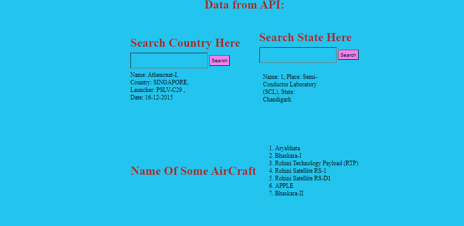
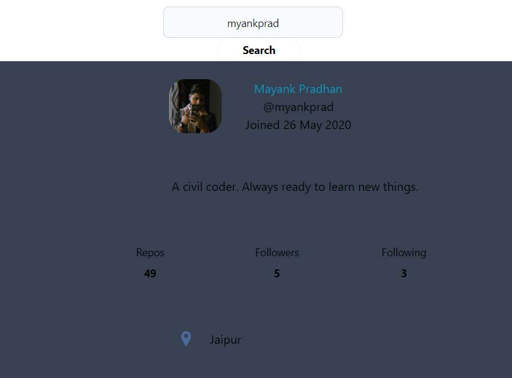

# FullStack Tech Consultant-Assesment

<h2>Task 1 </h2>
<h3><a href = "https://github.com/myankprad/FullStack-Tech-Consultant-Assesment-main/tree/master/Task1_Discord-Clone">Discord Clone</h3>

 <h1><a href = "https://gilded-pastelito-68611d.netlify.app/">Live Link</h3>

This web page is created with the help of pure HTML and Tailwind CSS

 

<h2>Task 2 </h2>
<h3><a href = "">ISRO</h3>
<h3><a href =" https://shiny-dodol-bdd49c.netlify.app">Live Link :</h3>

This project is build with the help of HTML CSS and JavaScript . I used fetch API to get the API of ISRO

 

# Task 3
# GitHub UserFinder

 A web application that allows users to search for other GitHub users and view their profiles. The application was built using JavaScript and the GitHub API, and is designed to be fast, responsive, and user-friendly.

## How it Works

The application uses the GitHub API to search for users based on their username. When a user submits a search query, the application sends a GET request to the API, which returns a list of matching users along with their profile information. The application then renders the results using JavaScript and displays them on the page.

##  [Live Link](https://beamish-druid-75a7ef.netlify.app).

## Built With

- HTML 
- Tailwind
- JavaScript
- GitHub API

